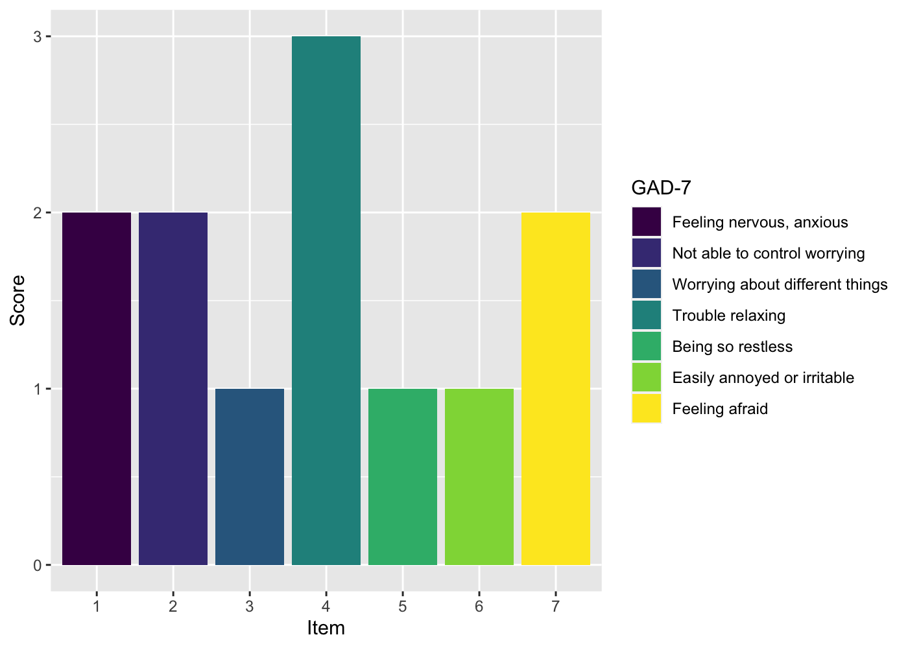

<!-- README.md is generated from README.Rmd. Please edit that file -->

# An R data package full of questionnaires

<!-- badges: start -->

[](https://travis-ci.com/milanwiedemann/questionnaires)
[](https://ci.appveyor.com/project/milanwiedemann/questionnaires)
<!-- badges: end -->

The goal is to provide a catalogue of questionnaire details (e.g item
labels, response categories, references, and more) to speed up the
analysis and reporting of results.

## Installation

You can install the development version from
[GitHub](https://github.com/milanwiedemann/questionnaires) with:

``` r
# install.packages("devtools")
devtools::install_github("milanwiedemann/questionnaires")
```

## Available Questionnaires

  - **Patient Health Questionnaire 9-item scale** (PHQ-9; Kroenke,
    Spitzer, & Williams,
    [2001](https://doi.org/10.1046/j.1525-1497.2001.016009606.x))
  - **Generalized Anxiety Disorder 7-item scale** (GAD-7; Spitzer,
    Kroenke, Williams, & Löwe,
    [2006](https://doi.org/10.1001/archinte.166.10.1092))

## Examples

### Creating figures

This example illustrates how item labels from this package can be used
in ggplot2 figures.

``` r
# Load packages
library(ggplot2)
library(tibble)
library(questionnaires)
set.seed(1234)

# Create some data
df <- tibble(item = 1:7,
             score = sample(1:3, 7, replace = T))

# Create figure using short labels from gad7
ggplot(df, aes(x = factor(item), y = score, fill = factor(item))) +
  geom_bar(stat="identity") +
  ggplot2::scale_fill_viridis_d(labels = gad7$item_label_short) +
  labs(x = "Item", y = "Score", fill = gad7$measure_short)
```



### Creating Tables

This is a basic example which shows how to create a table with long
label descriptions of the PHQ-9:

``` r
# Load packages ----
library(questionnaires) # For questionnaire data
library(dplyr) # For data manipulation
library(knitr) # For creating tables

phq9 %>%
    select(item_number, item_label_long) %>% 
    kable(col.names = c("Item", "Description"))
```

| Item | Description                                                                                                                                                              |
| ---: | :----------------------------------------------------------------------------------------------------------------------------------------------------------------------- |
|    1 | Little interest or pleasure in doing things                                                                                                                              |
|    2 | Feeling down, depressed, or hopeless                                                                                                                                     |
|    3 | Trouble falling or staying asleep, or sleeping too much                                                                                                                  |
|    4 | Feeling tired or having little energy                                                                                                                                    |
|    5 | Poor appetite or overeating                                                                                                                                              |
|    6 | Feeling bad about yourself — or that you are a failure or have let yourself or your family down                                                                          |
|    7 | Trouble concentrating on things, such as reading the newspaper or watching television                                                                                    |
|    8 | Moving or speaking so slowly that other people could have noticed? Or the opposite — being so fidgety or restless that you have been moving around a lot more than usual |
|    9 | Thoughts that you would be better off dead or of hurting yourself in some way                                                                                            |

### Reference items in text

When writing in RMardown it’s easy to reference item labels in text
using the following:

``` r
Most clients showed most improvement on item 1 of the GAD-7 ('`r questionnaires::gad7[[1, "item_label_long"]]`')
```

Most clients showed most improvement on item 1 of the GAD-7 (‘Feeling
nervous, anxious or on edge’)

## How to contribute / add more questionnaires

A new questionnaire can be added to this library by creating a dataset
with all information in the
[`create-measures.R`](data-raw/create-measures.R) in the `data-raw`
folder of this repositoty. Details for a new dataset needs to be added
to [`data.R`](R/data.R) file in the data folder of this repositoty.

## TODO / TOTHINK

  - Which licence would be appropriate for a data package like this?
  - What are the legal challanges with copyright, license fees … and
    does it even matter for a project like this?
  - Which information about a measure should be available in the help
    files, e.g. internal consistentcy, test-retest reliability, cutoffs,
    … ?
  - How to best name data sets so it doesn’t get confusing, e.g. `gad7`
    vs `general_health_anxiety_questionnaire_7item`?
  - What’s a good package name, e.g. `measureme`, `measureR`, `measuRes`
    vs `questionnaires`?
  - What’s the best data structure to store this information, especially
    when questionnaires are not straightforward, e.g. different repsonse
    categories for each item?
  - How could different languages of the same questionnaire be
    integrated, e.g. suffix `_en` for English, `_de` for German?
  - This could also be integrated in a shiny app or similar, what are
    the implications of this?
